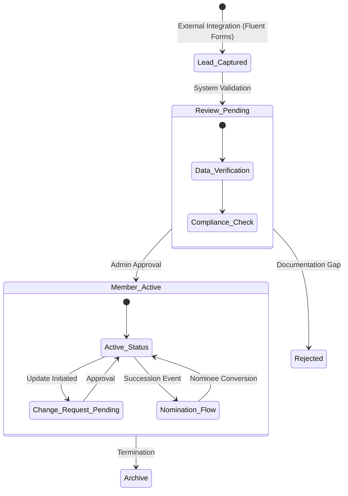
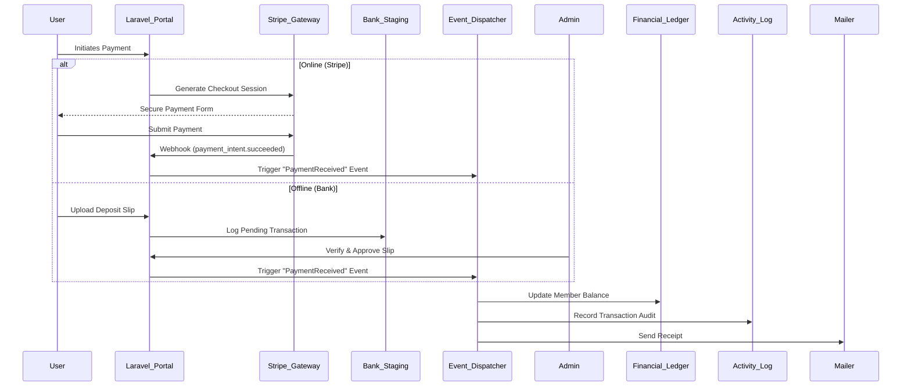
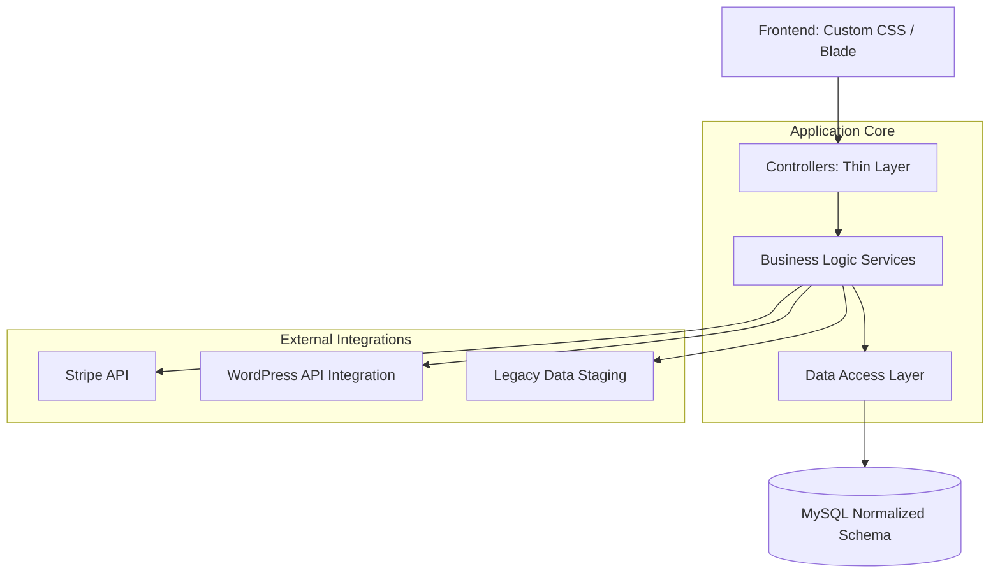
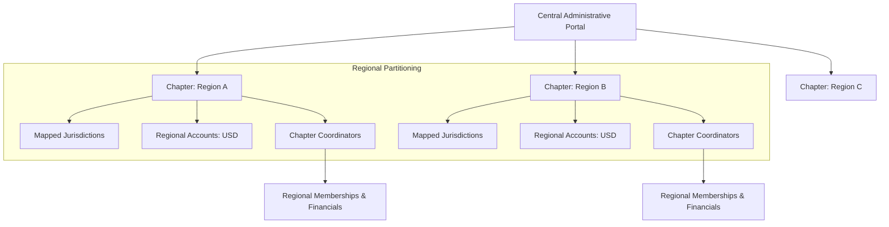

# Abstract System Architecture: Membership Management Portal

These diagrams visualize the core logic and engineering patterns of the Membership Management Portal. They are designed for technical portfolios to demonstrate system design and workflow management.

## 1. Membership Lifecycle & State Machine
This diagram shows the complex transition from an external lead to a verified member, including the multi-level approval and nomination succession logic.

## 2. Event-Driven Payment Architecture (Stripe Integration)
This diagram illustrates the robust, idempotent handling of online and offline payments, ensuring financial integrity.

## 3. High-Level System Decoupling (Service Layer)
A visualization of the Clean Architecture used to separate concerns, making the system scalable and testable.

## 4. Global Multi-Regional Architecture
Visualizes how the system handles international scale by partitioning data and administration across global chapters and mapped countries.

