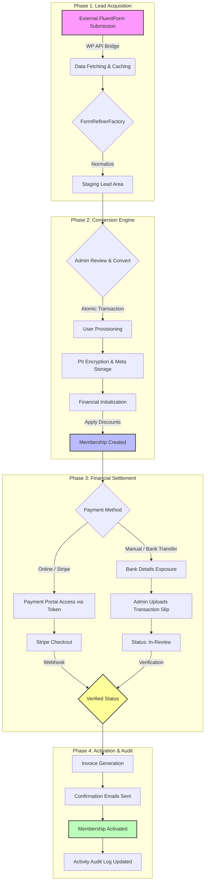

# Workflow Visualization: The Membership Journey

This flowchart illustrates the end-to-end lifecycle of a member, from the initial external application (Lead) to the final financial verification (Payment).

## Journey Breakdown

### 1. Lead Acquisition
The journey begins outside the portal on a WordPress site. The **API Bridge** handles the secure transport of data, while the **Refiner Factory** ensures that diverse form structures are flattened into a consistent schema for the portal.

### 2. Conversion Engine
This is the most critical technical step. The system atomically creates the User identity, encrypts sensitive data (PII), and initializes the financial obligations. If a spouse or nominee is included, they are provisioned simultaneously to maintain relational integrity.

### 3. Financial Settlement
The system supports a dual-path payment architecture:
- **Automated**: Leverages Stripe with regional routing and webhook callbacks for instant verification.
- **Manual**: Provides jurisdictional bank details and a secure "In-Review" workflow for admin-led verification of bank transfers.

### 4. Activation & Audit
Activation is the final state change. Once verified, the system generates a unique invoice number, notifies all stakeholders (Member and Global CFO), and locks the financial record to prevent future tampering.
